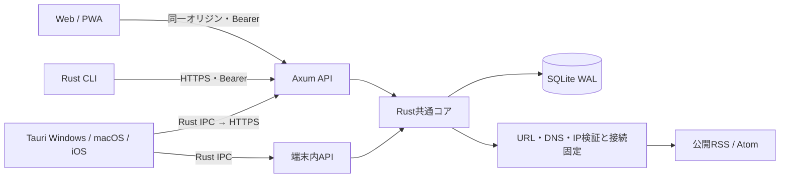

# Kanso RSSの設計

Rustの共通コアがRSS取得とSQLite永続化を所有します。Axum APIをネイティブ・Web・CLIが共通で使います。画面は外部UIライブラリを使わないHTML/CSS/JavaScript、ネイティブシェルはTauri 2です。

単一ライブラリのセルフホストを対象にしています。リモートサーバーと端末内DBは独立し、接続切替で選びます。自動データマージ、複数ユーザー、課金、公開アカウント登録は現行実装に含まれません。

## 永続化と更新

フィードURLを正規化し一意制約で重複を防ぎます。記事はフィードIDと元エントリIDのSHA-256によって重複を判定し、再取得時に既読・スターを維持します。IDがない記事はリンクとタイトルから安定したIDを生成します。更新で既存本文を上書きする機能は現行版に含みません。

SQLiteはWALと外部キーを有効にし、書込みはトランザクション、OPMLインポートは全件検証とセーブポイントを使います。DB操作はTokioのblockingプールへ移し、HTTP処理をブロックしません。DBの新しいスキーマを旧アプリが開いた場合は拒否します。現行スキーマはversion 1です。今後のマイグレーション追加時には旧データを使う移行テストを必須にします。

3文字以上の検索はSQLite FTS5のtrigram索引を使い、日本語の部分一致に対応します。索引は同じトランザクション内のトリガーで更新します。1–2文字の検索はLIKEで処理します。検索語はSQLパラメータと引用したFTS句として渡し、検索構文やSQLを入力から組み立てません。

更新処理は1インスタンスあたり1ジョブに限定します。全フィードの更新はバックグラウンドジョブとして開始し、進捗APIで確認できます。フィードごとに失敗を記録し、他のフィードの処理を続けます。単一ジョブが全フィードを順に処理するため、500フィードすべてがタイムアウトした場合は数時間かかり得ます。インターネット上のフィードサーバーへの負荷を抑える運用を優先しています。

## 境界と上限

| 項目 | 制限 |
|---|---|
| フィード取得先 | HTTP(S)、80/443、公開IPのみ |
| リダイレクト | 最大5回、各宛先を再検証、HTTPS降格を拒否 |
| 取得 | 全体25秒、接続5秒、応答15秒、2 MiB |
| XML | DTD拒否、深さ64、要素50,000 |
| 1フィードの解析結果 | 最大1,000記事 |
| 保存 | 500フィード、全体100,000記事 |
| 保持 | 各フィード最新5,000記事＋保持対象のスター |
| API | 認証済み同時リクエスト32、本文1 MiB |
| 記事一覧 | 最大200件、本文プレビュー400文字 |
| OPML | 1 MiB、500フィード、深さ20 |

全体記事数が上限に達すると新しい記事の挿入を拒否し、フィードに保存エラーを記録します。不要な購読の削除で容量を空けられます。保存上限、保持方針、未読記事の削除について変更する場合は運用要件に合わせて検討してください。高負荷・複数ユーザー用途への展開にはデータ分離、ユーザー認証、ジョブキュー、DB接続管理の設計を追加する必要があります。
